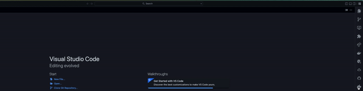
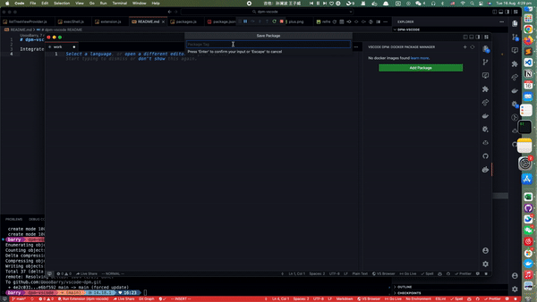
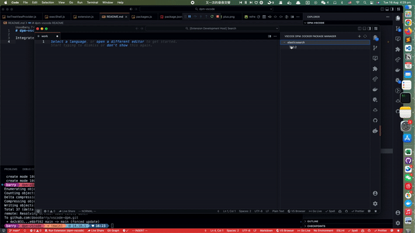

# README

[](https://github.com/airbnb/javascript)


Integrate [DPM](https://github.com/songhuangcn/dpm) to VsCode. Easily start any docker images without complicated configurations.

## Prerequisites

This extension relies on [DPM](https://github.com/songhuangcn/dpm) project. Install DPM first is necessary.

### Docker

Ensure [Docker](https://www.docker.com/products/docker-desktop/) is running.

### Ruby

Check if ruby exists in your system.

```bash
ruby -v
```

If you do not have ruby, you can install it either using [Rbenv](https://github.com/rbenv/rbenv), [RVM](https://rvm.io/)

Or Just using brew:

```bash
brew install ruby
```

### DPM

```bash
gem install dpmrb
```

## Usage



### Add a package

Open command palette and type: `Add A DPM Package`, or use the `+` icon in GUI.



### Start a service


